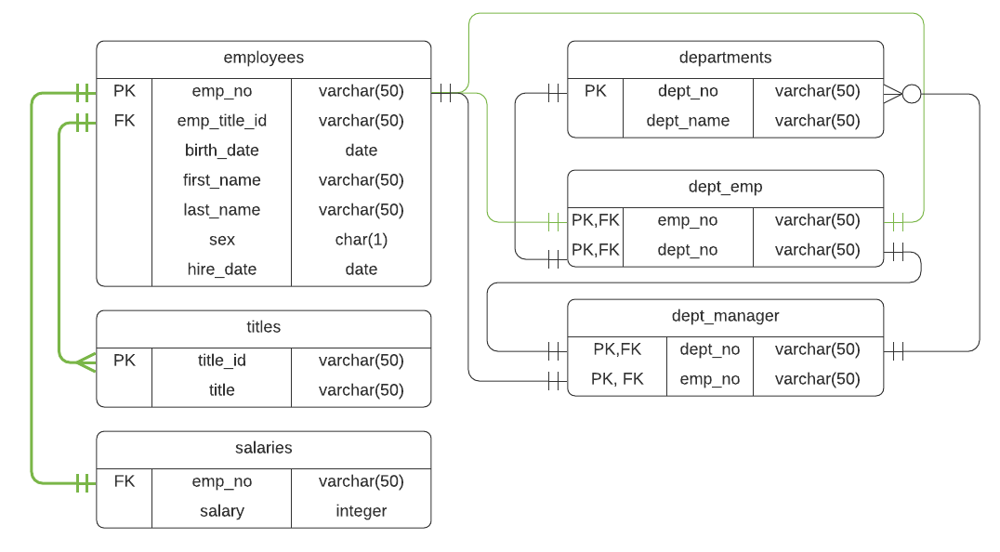
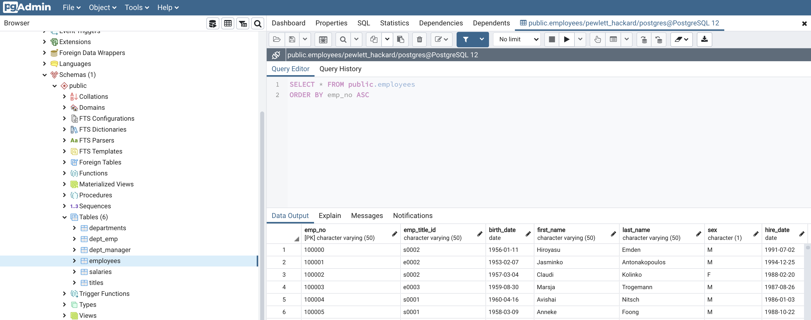
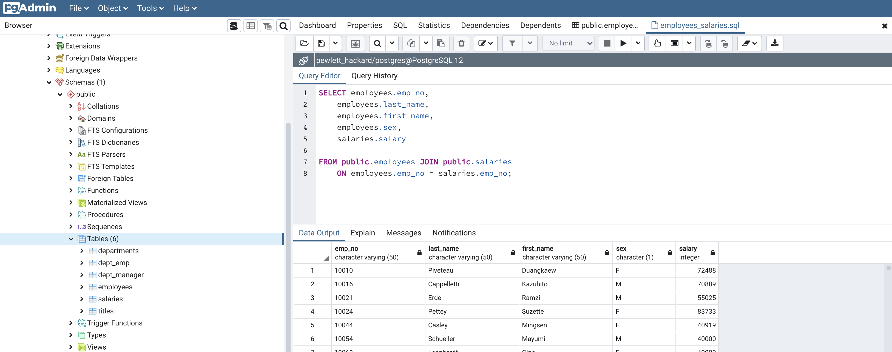
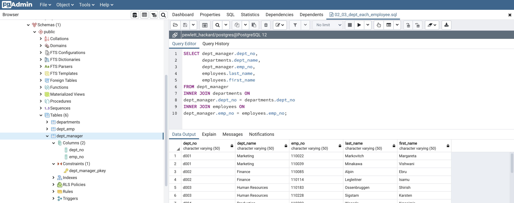
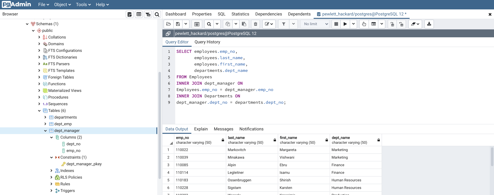
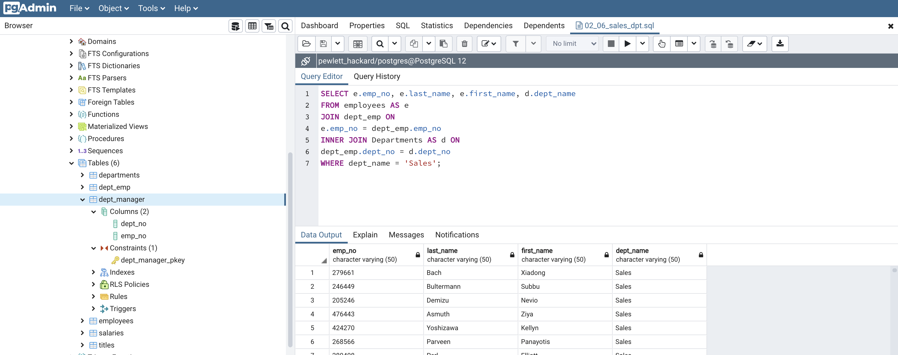
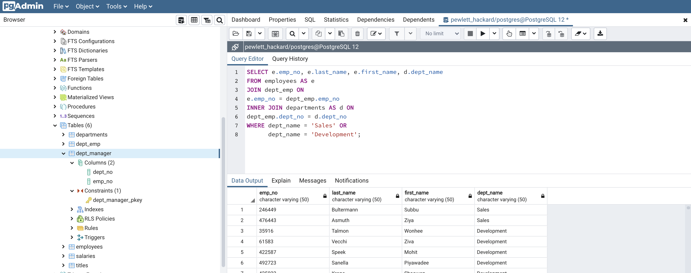
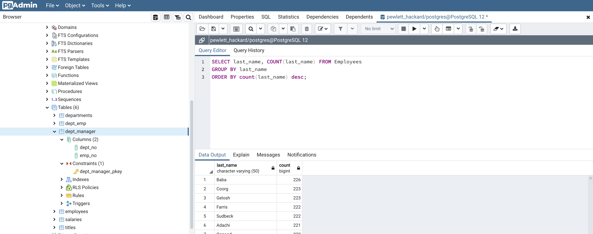

# sql-challenge
###### by Libardo Lambrano

## Background <a name="top"></a>

Using POSTGRESQL design tables to hold provided data in CSV format. Import the CSVs into a SQL database, and answer the following questions about the data.


## Data Modeling <a name="data_modeling"></a>

**Request**

Inspect the CSVs and sketch out an ERD of the tables



## Data Engineering <a name="data_engineering"></a>

**Request**

* Use the information you have to create a table schema for each of the six CSV files. Remember to specify data types, primary keys, foreign keys, and other constraints.

* Import each CSV file into the corresponding SQL table. Note be sure to import the data in the same order that the tables were created and account for the headers when importing to avoid errors.

<details><summary>click here to view steps</summary>

### 1. Create table

```sql
    CREATE TABLE "dept_emp" (
    "emp_no" varchar(50),
    "dept_no" varchar(50),
    PRIMARY KEY ("emp_no", "dept_no")
    );

    CREATE TABLE "dept_manager" (
    "dept_no" varchar(50),
    "emp_no" varchar(50)
    );

    CREATE TABLE "employees" (
    "emp_no" varchar(50),
    "emp_title_id" varchar(50),
    "birth_date" date,
    "first_name" varchar(50),
    "last_name" varchar(50),
    "sex" char(1),
    "hire_date" date
    );

    CREATE TABLE "departments" (
    "dept_no" varchar(50),
    "dept_name" varchar(50),
    PRIMARY KEY ("dept_name")
    );

    CREATE TABLE "salaries" (
    "emp_no" varchar(50),
    "salary" integer
    );

    CREATE TABLE "titles" (
    "title_id" varchar(50),
    "title" varchar(50),
    PRIMARY KEY ("title_id")
    );
```

2. Import CSV to SQL table



</details>

## Data Analysis <a name="data_analysis"></a>

**Request**

Once you have a complete database, do the following:

>List the following details of each employee: employee number, last name, first name, sex, and salary. 

<details><summary>view solution</summary>



```sql
    SELECT employees.emp_no,
        employees.last_name,
        employees.first_name,
        employees.sex,
        salaries.salary

    FROM public.employees JOIN public.salaries
        ON employees.emp_no = salaries.emp_no;
```
</details>

> List first name, last name, and hire date for employees who were hired in 1986.

<details><summary>view solution</summary>


```sql
    SELECT emp_no, first_name, last_name, hire_date from Employees
    WHERE hire_date >= '1985-12-31'
    AND hire_date < '1987-01-01';
```
</details>

> List the manager of each department with the following information: department number, department name, the manager's employee number, last name, first name.

<details><summary>view solution</summary>



```sql
    SELECT dept_manager.dept_no, 
        departments.dept_name,
        dept_manager.emp_no,
        employees.last_name,
        employees.first_name
    FROM dept_manager
    INNER JOIN departments ON
    dept_manager.dept_no = departments.dept_no
    INNER JOIN employees ON
    dept_manager.emp_no = employees.emp_no;
```
</details>

> List the department of each employee with the following information: employee number, last name, first name, and department name.

<details><summary>view solution</summary>



```sql
    SELECT employees.emp_no, 
        employees.last_name, 
        employees.first_name,
        departments.dept_name
    FROM Employees
    INNER JOIN dept_manager ON
    Employees.emp_no = dept_manager.emp_no
    INNER JOIN Departments ON
    dept_manager.dept_no = departments.dept_no;
```
</details>

> List first name, last name, and sex for employees whose first name is "Hercules" and last names begin with "B."

<details><summary>view solution</summary>


```sql
    SELECT * FROM employees
    WHERE first_name = 'Hercules'
    AND last_name LIKE 'B%';
```
</details>

> List all employees in the Sales department, including their employee number, last name, first name, and department name.

<details><summary>view solution</summary>



```sql
    SELECT e.emp_no, e.last_name, e.first_name, d.dept_name
    FROM employees AS e
    JOIN dept_emp ON
    e.emp_no = dept_emp.emp_no
    INNER JOIN Departments AS d ON
    dept_emp.dept_no = d.dept_no
    WHERE dept_name = 'Sales';
```
</details>

> List all employees in the Sales and Development departments, including their employee number, last name, first name, and department name.

<details><summary>view solution</summary>



```sql
    SELECT e.emp_no, e.last_name, e.first_name, d.dept_name
    FROM employees AS e
    JOIN dept_emp ON
    e.emp_no = dept_emp.emp_no
    INNER JOIN departments AS d ON
    dept_emp.dept_no = d.dept_no
    WHERE dept_name = 'Sales' OR 
        dept_name = 'Development';
```
</details>

> In descending order, list the frequency count of employee last names, i.e., how many employees share each last name.

<details><summary>view solution</summary>



```sql
    SELECT last_name, COUNT(last_name) FROM Employees
    GROUP BY last_name
    ORDER BY count(last_name) desc;
```
</details>

[Folder with all queries](queries)


